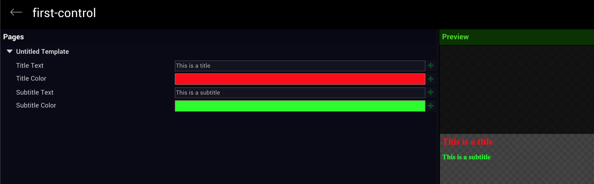
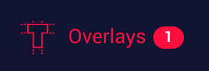
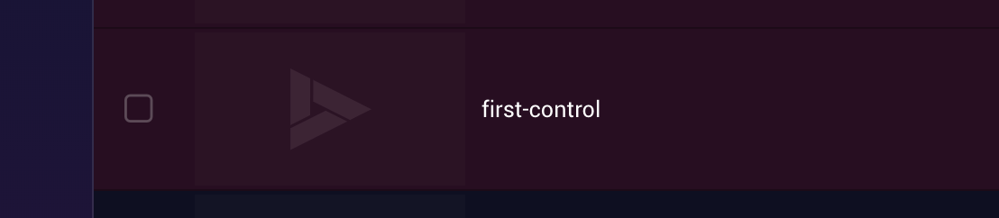
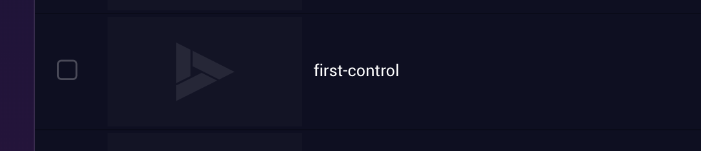

# Introduction

VFF is lightweight JavaScript library built to create graphic overlays for Videoflow. VFF exposes properties in your HTML overlay to the Videoflow player. This way, when an overlay is loaded in Videoflow player,
the properties that were registered via VFF will be visible to the user in the controller and the user will be able to change those properties from the controller or via the API. Simple put, VFF turns your HTML to a template.

VFF also has a set of global function that are design to help you control the project from within the overlay. For example, you can use those global functions to call another page in the project, or to know that container is currently hosting
the project. For example, you might want to display more data if the project is loaded in a controller and less data if the project is loaded on a regular or a mobile page.

VFF is extensible, the extensions are designed to add extra functionality that otherwise would not be available in traditional HTML workflows. For example a drawing surface that would allow users to draw on top of the overlay.


# Getting Started

## Create your overlay app
An overlay in videoflow is a static web application, that will be loaded on top of your video content, or over a transparent background in case the underlying video is a 3rd party player. You can use your favorite framework to write all the logic
you need for your overlay, but in addition you'll need to add the VFF lib. A basic structure of an overlay should have three components:
- HTML - The markup of the structure and the layout of the overlay
- Javascript - The logic and the behavior of the content
- CSS - The look of the overlay

## Include the VFF lib
Add the following code in your HTML header

```html
<script src="https://unpkg.com/vff@1"></script>
```

## Create your first control
A control is a connection between an element in the overlay and Videoflow's controller.
The control can be created by simply adding the attribute ```vff-control="name"```
```html
<div id="header">
    <h1 vff-control="title">This is a title</h1>
    <h2 vff-control="subtitle">This is a subtitle</h2>
</div>
```


## Publish your content
In order to use your newly created overlay, you need to host it in a publicly available accessible location.
The easiest way to do so is by using VFF-CLI

Quick guide:
1. Open your terminal
2. `npm install -g vff-cli`
3. Go to the overlay folder
4. `vff init`
5. Answer the questions
6. `vff login`
7. Fill in your credentials
8. `vff serve`

`vff serve` will serve the overlay from your local computer and it will not be uploaded, 
use `vff serve` command for development proposes.
When you serve an overlay, you will see a badge appear next to the overlays section in Videoflow's dashboard:

and the overlay item will appear in the overlays gallery

If you see a broken link icon next to the overlay name

it means that the overlay is not properly served, try running `vff serve` again

When you think your overlay is ready or you want to see it in production environment, use `vff deploy`.
The overlay will be uploaded to Videoflow's servers and will become independent from your local computer.
hen the overlay is deployed it will appear in the overlay gallery with a different background color.

If you want to update your deployed overlay just run `vff deploy` again.
>[!TIP] You can have the same overlay both served and deployed at the same time


**Please refer to the [cli docs](https://github.com/TwiztedDesign/vff-cli/blob/master/README.md) for the full VFF-CLI documentation**
<!-- 
## The Controller
Explaining the videoflow controller with screenshots.
 -->

## Groups and Namespaces
In Videoflow, each control is part of a group, a group name for a control can be provided via the **group** property in the options object, or via the **namespace** notation.
If no group name is provided, a default group name will be set to "untitled template".
The namespace notation looks like: **{group name}.{control name}**.

```html
<h1 vff-control="title">Title</h1>
```
is the same as 
```html
<h1 vff-control="untitled template.title">Title</h1>
```
and the same as
```javascript
vff.registerControl("title", "Title", {group: "untitled template"});
//or
vff.registerControl("untitled template.title", "Title");
```

All the controls with the same group name will be grouped in the controller
>[!NOTE]
- Group names are case sensitive
- Control names in *vff-control* attributes must not contain spaces 

## HTML Attributes
A control is a communication channel between the overlay and the controller.
To control a simple text in the overlay from the controller you can do the following:
```html
<span id="title"></span>
```
```javascript
vff.registerControl("header.title", "").on(event => {
    document.getElementById("title").innerText = event.data;
})
```
### vff-control
A shorter way of doing that is using *HTML Attributes*:
```html
<span vff-control="header.title"></span>
```
This will expose the innerText attribute to the controller automatically.
Each HTML element will expose different parameters by default when using *vff-control* attribute:

| HTML Element | Exposed Parameters |
| :------------:| ----------------- |
| &lt;H1>       | innerText<br>style.color |
| &lt;span>     | innerText |
| &lt;p>        | innerText |
| &lt;img>      | src |

### vff-options

The *vff-options* attribute excepts the same options object as you would pass to *vff.registerControl*

```html
<span vff-control="title" vff-options="{group : 'header'}"></span>
```

<!-- 
## Registering multiple controls
 -->

## Adding controls (JavaScript)
```javascript
let title = vff.registerControl("header.title", 'This is a title');
let subtitle = vff.registerControl("subtitle", 'This is a subtitle', {group : "header"});
```
The above code will generate the same result as the code we used in the "Getting Started" example in the HTML file.
The function "registerControl" will return a control object that will contain functions for events and additional data. Note that when registering the control via js, you can specify any name you want for the control,
the first parameter is the name of the control as it would be displayed in the controller (title) and the second parameter is the value of the control.


# window.vff

After including the vff script in your html file, a "vff" object is set on the window object.

## Methods

### registerControl(name, value, options)
* **name** - _string_ - name of the control
* **value** - _Any_ - value of the control
* **options** - _object_ - refer to the options object (optional)

Registers a control in the VFF and returns a control object

```javascript
vff.registerControl("title", "Title text");
```


### registerControls(controls, options)
* **controls** - _object_ - an object representing multiple controls where the key is the name and the value is the value of the control
* **options** - _object_ - refer to the options object

Registers multiple controls in the VFF.

### track(name, properties)
* **name** - _string_ - name of the event
* **properties** - _object_ - an object of arbitrary properties (optional)

Use "track" for sending statistical information about user action and engagement,
it can be viewed in the statistics section in the videoflow platform.


### transform(fromX0, fromY0, fromX1, fromY1, topX0, toY0, fromX1, toY1, options)
#### transform(fromX0, fromY0, fromX1, fromY1, options)
* **fromX0** - _float_ - percent value \[0-1\] of the top left X coordinate
* **fromY0** - _float_ - percent value \[0-1\] of the top left Y coordinate
* **fromX1** - _float_ - percent value \[0-1\] of the bottom right X coordinate
* **fromY1** - _float_ - percent value \[0-1\] of the bottom right Y coordinate
* **toX0** - _float_ - percent value \[0-1\] of the top left X coordinate **(default 0)**
* **toY0** - _float_ - percent value \[0-1\] of the top left Y coordinate **(default 0)**
* **toX1** - _float_ - percent value \[0-1\] of the bottom right X coordinate **(default 1)**
* **toY1** - _float_ - percent value \[0-1\] of the bottom right Y coordinate **(default 1)**
* **options** - _object_ - optional


Transforms part of the video content to another part of the screen  


<!-- ### updateControl(name, value, options)
### getControl(name)
### ready(callback)
### onUpdate(callback)
### getPages()
### onPages(callback)
### on(namespace, callback, options)
### getQueryParams()
### send(type, payload)
### request(type, payload, callback)
### setup(options)
### isMobile
### isController()
### mode
### MODE
### defer
### uuid
### extend(name, extension)
### define(name, element)
### sync(element)
### enableOverscroll()
### disableOverscroll()


### videoTransform(top, left, width, height) //crop
### get(url, callback)
### track(name, data) -->

<!-- 

|       Method     | Details                                                                                             |
|------------------|-----------------------------------------------------------------------------------------------------|
| registerControl(**name**, **data**, **options**)       | Registers a control in the VFF and returns a control object<br>**name** - _string_ - name of the control<br>**value** - _Any_ - value of the control<br>**options** - _object_ - refer to the options object|
| registerControls(**controls**, **options**)            | Registers multiple controls in the VFF<br>**controls** - _object_ - an object representing multiple controls where the key is the name and the value is the value of the control<br>**options** - _object_ - refer to the options object|
| updateControl(**name**, **value**, **options**)   | Updates the value of a specific control<br>**name** - _string_ - name of the control to update<br>**value** - _Any_ - value to be updated<br>**options** - _object_ - refer to the options object|
| on(**namespace**, **callback**, **options**)       | trigger callback when data for any of the controls is the **namespace** arrives<br>**namespace** - _string_ - dot delimited string that describes a controls in the same namespace<br>**callback** - _function(**data**)_ - data handler<br>**options** - _object(optional)_ - options object (described [here](#options))|
| setup(**options**)                                | Sends global options to the videoflow platform (described [here](#setup))|

## Setup
The setup allows you to send options to videoflow platform in order to define property fields that relevant to your project.
The options object looks the follow
```javascript
// Creating the options object
var options = {
    overrides: [
        {
            key: "Show In Home Screen",
            visibility: true,
            rename: "Show In Side Bar"
        },
        {
            key: "Background",
            visibility: false
        }
    ]
};
// Send setup options
vff.setup(options);
```

### Overrides Options
|        Property    | Type      |  Default   | Details                                                                                         |
|--------------------|-----------|------------|-------------------------------------------------------------------------------------------------|
| key                | _String_  | *empty*    | The field that you want to change. The key should be like the name in the UI |
| visibility         | _String_  | *true*     | Show or hide the field |
| rename             | _String_  | *key*      | Rename the field |


# Controls
Once the VFF lib is registered, it generates a global object that you can access from anywhere in your code. The global object "vff" contains all the functions and the properties you need to generate controls and control your overlay.
The "vff" object also contains events that will be fired based on various conditions, such as a change in a data that arrives from an external source like a controller or an API call.


## Methods
|        Method      | Details                                                                                               |
|--------------------|-------------------------------------------------------------------------------------------------------|
| on(**callback**, **options**)  | triggers callback when data for the control arrives<br>**callback** - _function(**data**)_ - data handler<br>**options** - _object(optional)_ - options object (described [here](#options))|
| before(**middleware**, **options**)| add a middleware function that will be triggered in the order of the addition when data for the control arrives<br>**middleware** - _function(**data**, **next**)_ - the middleware function ([read more](#middleware))<br>**options** - _object(optional)_ - options object (described [here](#options))|
| emit(**payload**) | Emits a message to every player with the same project<br>**payload** - _object_ - data to be sent     |

## options
|        Property    | Type      |  Default   | Details                                                                                         |
|--------------------|-----------|------------|-------------------------------------------------------------------------------------------------|
| changeOnly         | _Boolean_ | *true*     | trigger callback only if data is changed |
 -->

[](https://travis-ci.org/TwiztedDesign/vff)


